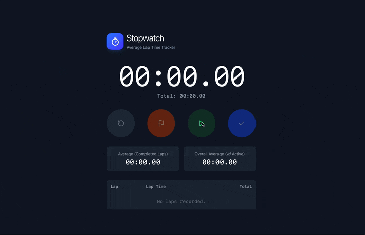

# Stopwatch Web App

It's a stopwatch app. What more do you want? Is displays your fastest/slowest lap and keeps track of average lap time (for completed laps and live including the active app).

This is hosted on [my website](https://stopwatch.joelbreit.com)



## Technology

This is a **React web app** using **Tailwind v4** for styling and **lucide-react** for icons set up with **Vite** and **JavaScript** for quick development.

Hosted on AWS with Amplify.

## Run this Project on Your Own

1. Clone this repository
2. Open/navigate to the project folder
3. Install dependencies

```bash
npm install
```

4. Verify that the project is working

```bash
npm run dev # http://localhost:5173
```

## Build the Project

To build the project for production, run:

```bash
npm run build
npm run preview # http://localhost:5173
```